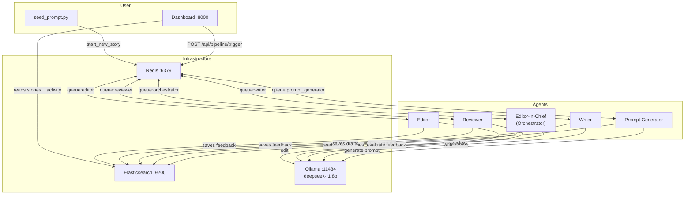
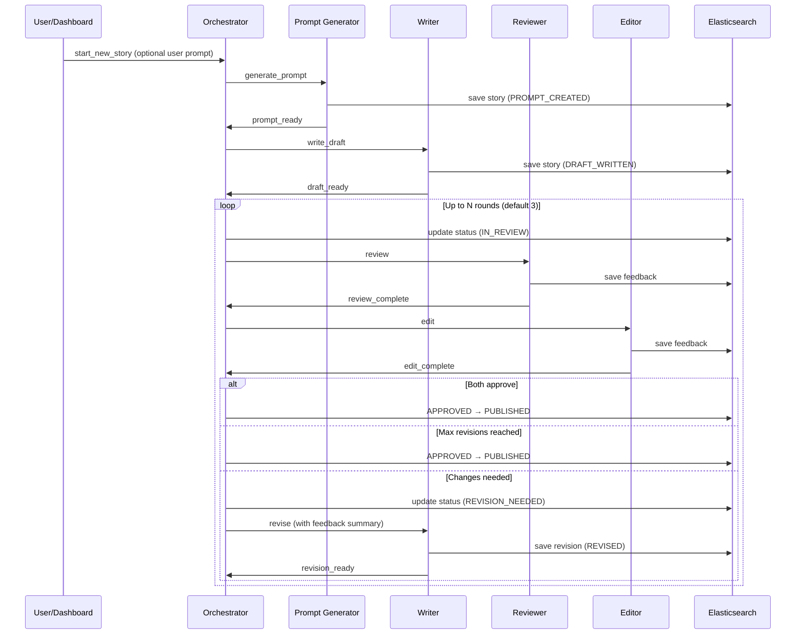
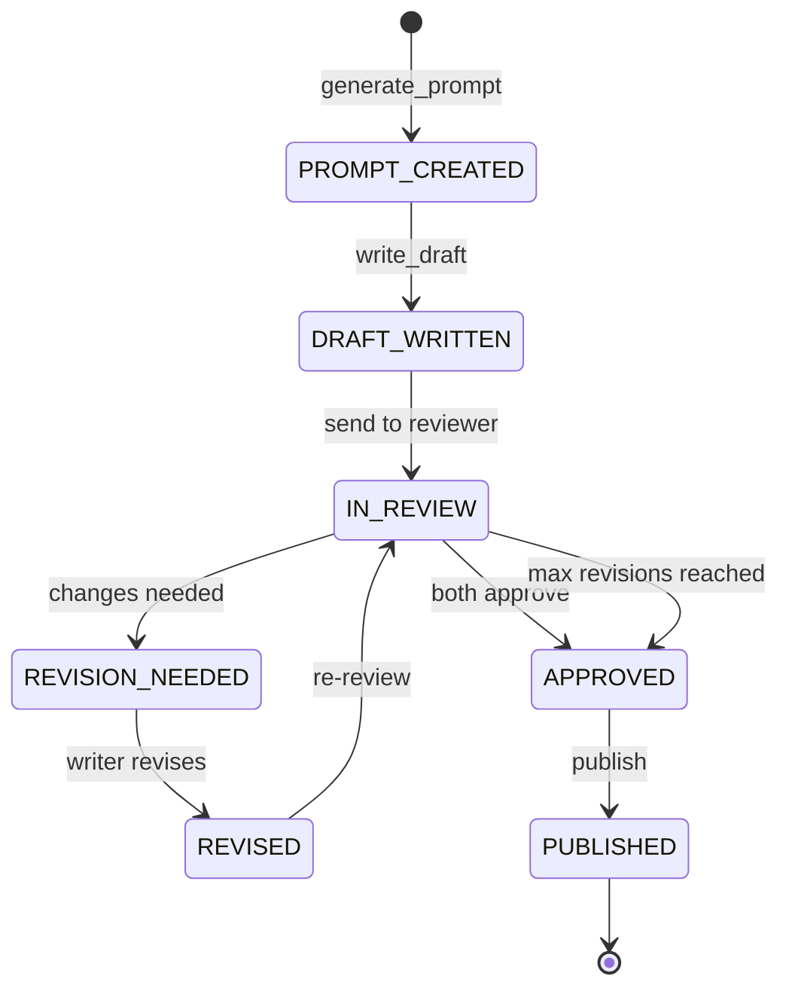

# AI Publishing House - Multi-Agent System

A multi-agent AI publishing house that automatically generates short stories. Five dockerized Python agents communicate via Redis queues, use Ollama (deepseek-r1:8b) for generation, store documents in Elasticsearch, and are monitored via a FastAPI dashboard.

## Architecture



## Story Lifecycle



## Story States



## Quick Start

```bash
# Start all services
docker compose up --build -d

# Pull the model (first time only)
docker compose exec ollama ollama pull deepseek-r1:8b

# Open dashboard
open http://localhost:8000

# Or trigger a story from CLI
docker compose exec orchestrator python -m scripts.seed_prompt
docker compose exec orchestrator python -m scripts.seed_prompt "A detective who can taste lies"
```

## Services

| Service | Image | Port | Purpose |
|---|---|---|---|
| redis | redis:7-alpine | 6379 | Message queues + activity pub/sub |
| elasticsearch | ES 8.13 | 9200 | Story storage + activity logs |
| ollama | ollama/ollama | 11434 | LLM inference (GPU) |
| orchestrator | Dockerfile.agent | — | Central coordinator |
| prompt-generator | Dockerfile.agent | — | Creates writing prompts |
| writer | Dockerfile.agent | — | Writes drafts + revisions |
| reviewer | Dockerfile.agent | — | Substantive feedback |
| editor | Dockerfile.agent | — | Line-level feedback |
| dashboard | Dockerfile.dashboard | 8000 | FastAPI monitoring UI |
| init-services | Dockerfile.agent | — | One-shot ES index creation |

## Project Structure

```
multiagent/
├── docker-compose.yml
├── Dockerfile.agent              # Shared image for all agents
├── Dockerfile.dashboard
├── config/
│   ├── genres.yml                # Genre definitions + word counts
│   ├── pipeline.yml              # Max revisions, timeouts, ollama config
│   └── prompts/                  # System prompts per agent
├── shared/                       # Shared library
│   ├── models.py                 # Pydantic models (Story, AgentMessage, etc.)
│   ├── redis_client.py           # BRPOP/LPUSH queue helpers
│   ├── elasticsearch_client.py   # Story CRUD + activity logs
│   ├── ollama_client.py          # Ollama wrapper with retry + token tracking
│   ├── config_loader.py          # YAML + prompt file loading
│   ├── constants.py              # Queue names, index names, actions
│   └── logging_config.py         # structlog JSON setup
├── agents/
│   ├── base_agent.py             # Abstract base with main loop + metrics
│   ├── editor_in_chief.py        # Orchestrator with state machine
│   ├── prompt_generator.py
│   ├── writer.py
│   ├── reviewer.py
│   └── editor.py
├── dashboard/
│   ├── app.py                    # FastAPI app
│   ├── routes/                   # Pipeline, stories, agents routes
│   ├── templates/                # Jinja2 HTML templates
│   └── static/style.css
└── scripts/
    ├── init_elasticsearch.py     # ES index creation
    └── seed_prompt.py            # CLI story trigger
```

## Metrics

Every Ollama call is tracked per story with:
- **Wall-clock duration** per agent per step
- **Token usage** (prompt tokens, completion tokens, total)
- **Story-level totals** aggregated across all steps

View metrics on the story detail page in the dashboard.
