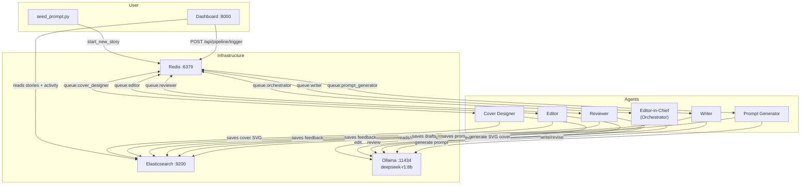
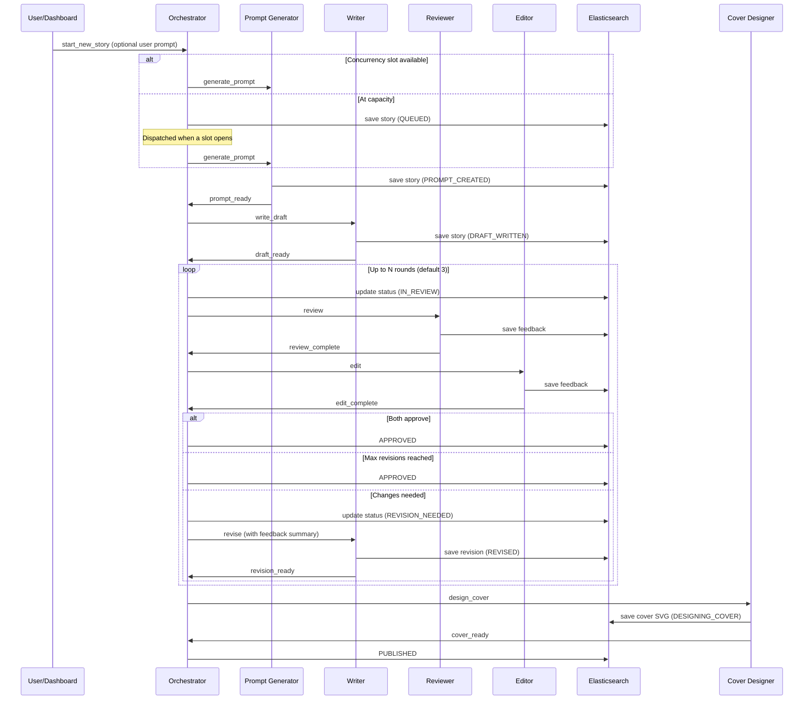
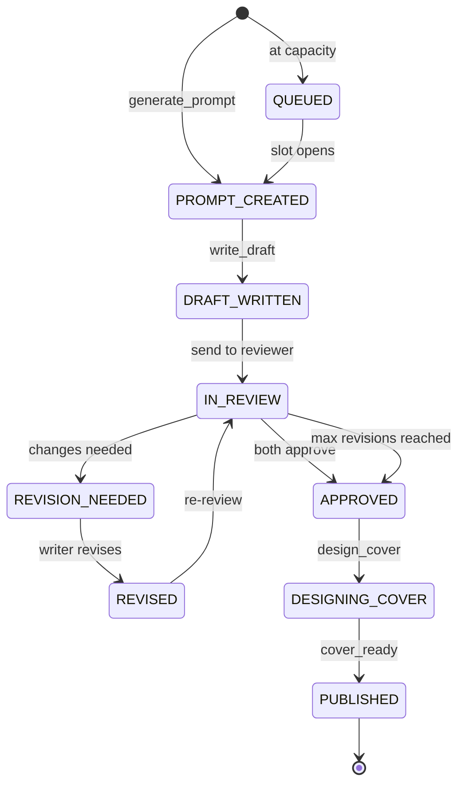

# AI Publishing House - Multi-Agent System

A multi-agent AI publishing house that automatically generates short stories. Six dockerized Python agents communicate via Redis queues, use Ollama (deepseek-r1:8b) for generation, store documents in Elasticsearch, and are monitored via a FastAPI dashboard.

## Architecture



## Story Lifecycle



## Story States



## Quick Start

```bash
# Start all services
docker compose up --build -d

# Pull the model (first time only)
docker compose exec ollama ollama pull deepseek-r1:8b

# Open dashboard
open http://localhost:8000

# Or trigger a story from CLI
docker compose exec orchestrator python -m scripts.seed_prompt
docker compose exec orchestrator python -m scripts.seed_prompt "A detective who can taste lies"
docker compose exec orchestrator python -m scripts.seed_prompt --genre horror "a dark forest"
```

## Services

| Service | Image | Port | Purpose |
|---|---|---|---|
| redis | redis:7-alpine | 6379 | Message queues + activity pub/sub |
| elasticsearch | ES 8.13 | 9200 | Story storage + activity logs |
| ollama | ollama/ollama | 11434 | LLM inference (GPU) |
| orchestrator | Dockerfile.agent | — | Central coordinator + concurrency gating |
| prompt-generator | Dockerfile.agent | — | Creates writing prompts |
| writer | Dockerfile.agent | — | Writes drafts + revisions |
| reviewer | Dockerfile.agent | — | Substantive feedback |
| editor | Dockerfile.agent | — | Line-level feedback |
| cover-designer | Dockerfile.agent | — | Generates SVG book covers |
| dashboard | Dockerfile.dashboard | 8000 | FastAPI monitoring UI + PDF export |
| init-services | Dockerfile.agent | — | One-shot ES index creation |

## Project Structure

```
multiagent/
├── docker-compose.yml
├── Dockerfile.agent              # Shared image for all agents
├── Dockerfile.dashboard
├── config/
│   ├── genres.yml                # Genre definitions + word counts
│   ├── pipeline.yml              # Max revisions, timeouts, ollama config
│   └── prompts/                  # System prompts per agent
├── shared/                       # Shared library
│   ├── models.py                 # Pydantic models (Story, AgentMessage, etc.)
│   ├── redis_client.py           # BRPOP/LPUSH queue helpers
│   ├── elasticsearch_client.py   # Story CRUD + activity logs
│   ├── ollama_client.py          # Ollama wrapper with retry + token tracking
│   ├── config_loader.py          # YAML + prompt file loading
│   ├── constants.py              # Queue names, index names, actions
│   ├── svg_utils.py              # SVG sanitization (text wrap, font clamp, overlap fix)
│   └── logging_config.py         # structlog JSON setup
├── agents/
│   ├── base_agent.py             # Abstract base with main loop + metrics
│   ├── editor_in_chief.py        # Orchestrator with state machine + concurrency
│   ├── prompt_generator.py
│   ├── writer.py
│   ├── reviewer.py
│   ├── editor.py
│   └── cover_designer.py         # SVG book cover generation
├── dashboard/
│   ├── app.py                    # FastAPI app
│   ├── pdf_export.py             # Book-style PDF generation with cover art
│   ├── routes/                   # Pipeline, stories, agents, anthologies routes
│   ├── templates/                # Jinja2 HTML templates
│   └── static/style.css
└── scripts/
    ├── init_elasticsearch.py     # ES index creation
    └── seed_prompt.py            # CLI story trigger
```

## Cover Designer

After a story is approved, the cover designer agent generates an SVG book cover using the LLM. The cover includes:

- Genre-appropriate color palette and decorative elements
- Story title and "AI Publishing House" imprint
- 600x900 viewBox (standard book cover proportions)

Generated SVGs are sanitized by `shared/svg_utils.py` which fixes common LLM output issues:
- Broken/malformed `<svg>` opening tags
- Text centering (`text-anchor="middle"`)
- Font size clamping (max 48px)
- Word wrapping for long text (max 20 chars/line via `<tspan>` elements)
- Overlap prevention (cumulative y-shift tracking across text elements)

Covers are rendered inline on the story detail page and embedded as full-page images in PDF exports (via cairosvg).

## Concurrency Gating

The orchestrator limits how many stories run in parallel, controlled by `max_concurrent_stories` in `config/pipeline.yml` (default: 1 for single-GPU setups). Excess stories are buffered in an in-memory queue and saved to Elasticsearch with `QUEUED` status for dashboard visibility. When a story finishes, the next queued story is dispatched automatically.

## Anthologies

The dashboard includes an **Anthologies** tab for creating and managing ebook collections from published stories:

- **Create** an anthology with a title, then add/remove published stories via checkboxes
- **AI-generated descriptions**: Click "Generate with AI" to produce a 2-3 sentence blurb from story titles, genres, and excerpts using the configured Ollama model
- **Editable**: Title and description can be hand-edited after generation
- **PDF download**: Generates a book-style PDF with custom title page, "About This Collection" page (if description exists), table of contents, and all included stories with cover art
- **Many-to-many**: Stories can belong to multiple anthologies

Data is stored in the `anthologies` Elasticsearch index. The Anthology model lives in `shared/models.py`.

## PDF Export

The dashboard provides PDF downloads for individual stories and multi-story anthologies:

- **Single story**: Cover art (SVG → PNG) as title page, followed by chapter with book typography
- **Anthology**: Custom title page, optional description page, table of contents, then each story with its cover art
- DejaVu Serif font for body text, justified paragraphs with first-line indentation
- Running headers (book title on even pages, chapter title on odd pages) and page numbers

## Metrics

Every Ollama call is tracked per story with:
- **Wall-clock duration** per agent per step
- **Token usage** (prompt tokens, completion tokens, total)
- **Story-level totals** aggregated across all steps

View metrics on the story detail page in the dashboard.
